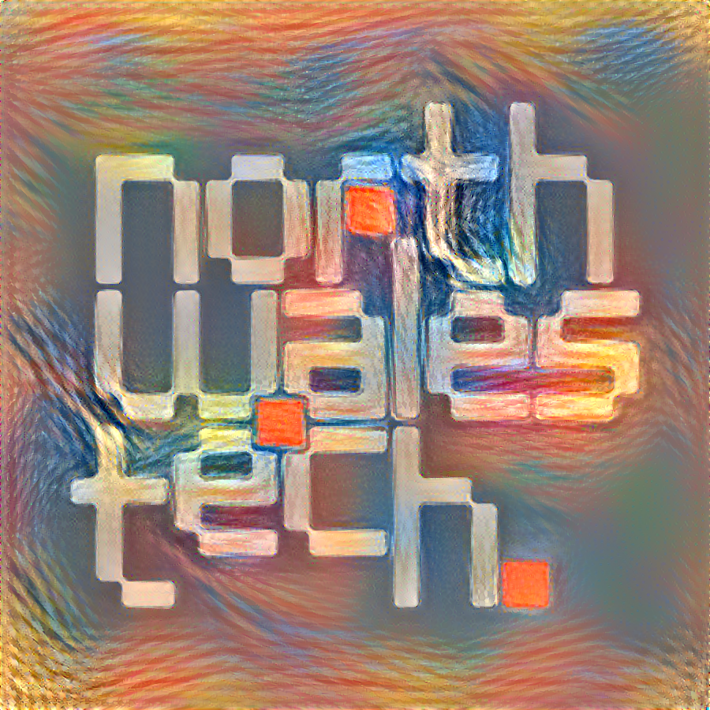
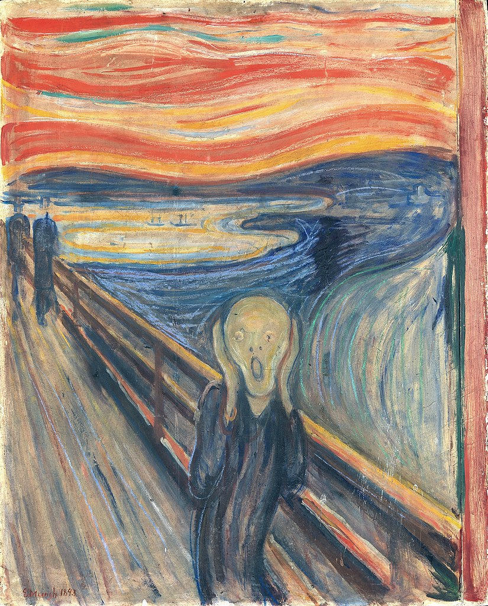

# Artificially Intelligent Art Workshop

## Neural Style Transfer

The *painting* of the North Wales Tech logo presented here has been created by applying ***A Neural Algorithm of Artistic Style*** as presented by Leon A. Gatys, Alexander S. Ecker, Matthias Bethge in their 2015 paper available here: https://arxiv.org/abs/1508.06576

In this paper the authors present an Artificial Intelligence system based on a Deep Neural Network that creates artistic images by separating and recombining neural representations of content and style from arbitrary images. The authors note the following observation of interest:

> In fine art, especially painting, humans have mastered the skill to
> create unique visual experiences through composing a complex interplay
> between the content and style of an image. Thus far the algorithmic
> basis of this process is unknown and there exists no artificial system
> with similar capabilities.

This technique is these days more commonly known as **Neural Style Transfer**.

## Creating the Style Transfered NWT Logo

### Style Input: The Scream by Edvard Munch in 1893

Norwegian: Skrik
German: Der Schrei der Natur (The Scream of Nature)

> I was walking along the road with two friends – the sun was setting –
> suddenly the sky turned blood red – I paused, feeling exhausted, and leaned
> on the fence – there was blood and tongues of fire above the blue-black
> fjord and the city – my friends walked on, and I stood there trembling with
> anxiety – and I sensed an infinite scream passing through nature.
> 
> -- Edvard Munch

Many commentators have suggested the painting represents the *the anxiety of modern man*.

## Input Image: The North Wales Tech Logo

## Neural Networks

https://playground.tensorflow.org/

## Hands on Workshops

### Beginners

https://tenso.rs/demos/fast-neural-style/

### Intermediate

There are many implementations of Neural Style Transfer out there, with an entire [Reddit thread](https://www.reddit.com/r/MachineLearning/comments/8o846n/d_what_is_the_best_implementation_of_neural_style/) dedicated to discussing which is best. A selection of the most commonly mentioned is listed below. The PyTorch based one was used to render the North Wales Tech logo.

Lua Torch based version: 

* https://github.com/jcjohnson/neural-style

Python based PyTorch Versions: 

* https://github.com/ProGamerGov/neural-style-pt

Python based TensorFlow versions:

* https://github.com/anishathalye/neural-style
* https://github.com/cysmith/neural-style-tf
* https://github.com/lengstrom/fast-style-transfer

### Advanced

For those of you that would like to learn more about what's going on and to learm more about the Machine Learning frameworks themselves see the following links.

* [Official PyTorch Neural Style Transfer Tutorial](https://pytorch.org/tutorials/advanced/neural_style_tutorial.html)
* [Porting Arbitrary Style Transfer to the Browser](https://magenta.tensorflow.org/blog/2018/12/20/style-transfer-js/)

## AI and Machine Learning in the Cloud

### Amazon Web Services

Overview: https://aws.amazon.com/machine-learning/

Pre-built machine images:

https://aws.amazon.com/machine-learning/amis/

### Google Cloud

Overview: https://cloud.google.com/products/ai/

Pre-built machine images:

https://console.cloud.google.com/marketplace/details/click-to-deploy-images/deeplearning

### Microsoft Azure

Overview: https://azure.microsoft.com/en-us/overview/ai-platform/

Machine Learning Studio:

https://azure.microsoft.com/en-gb/services/machine-learning-studio/

Pre-built machine images:

https://azure.microsoft.com/en-us/services/virtual-machines/data-science-virtual-machines/

Other bits:

https://notebooks.azure.com/pytorch

https://azure.microsoft.com/en-gb/blog/world-class-pytorch-support-on-azure/
https://azure.microsoft.com/en-gb/blog/microsoft-extends-ai-support-to-pytorch-1-0-deep-learning-framework/

## Other Links

http://karpathy.github.io/neuralnets/

http://cs231n.github.io/

https://www.youtube.com/watch?reload=9&v=i94OvYb6noo

https://arxiv.org/abs/1812.08434

https://www.quora.com/How-do-artificial-neural-networks-work

https://github.com/chuanli11/CNNMRF
https://deepai.org/machine-learning-model/CNNMRF

https://www.reddit.com/r/MachineLearning/comments/8o846n/d_what_is_the_best_implementation_of_neural_style/

https://medium.com/tensorflow/neural-style-transfer-creating-art-with-deep-learning-using-tf-keras-and-eager-execution-7d541ac31398

https://www.pyimagesearch.com/2018/08/27/neural-style-transfer-with-opencv/

https://medium.com/artists-and-machine-intelligence/neural-artistic-style-transfer-a-comprehensive-look-f54d8649c199

